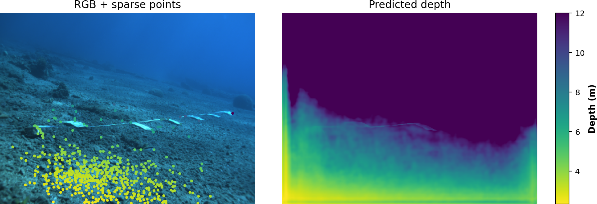

# Depth Estimation in the Underwater Danger Map Pipeline

This document explains how metric depth is estimated from underwater camera frames,
how those estimates drive the per-pixel risk score, and how depth is visualised in
the output video.

---

## 1. Why Depth Matters

The danger map needs to answer two questions for every pixel in the frame:

1. **What is here?** — answered by SUIM-Net semantic segmentation  
2. **How close is it?** — answered by SPADE metric depth estimation

Without depth, all hazards are treated equally regardless of distance.  A reef
20 m away should trigger far less urgency than the same reef at 1 m.  Multiplying
*hazard severity* by *proximity* produces a risk score that is both semantically
meaningful and spatially grounded.

---

## 2. The SPADE Depth Model

**SPADE** (Sparse-Prompted Anisotropic Depth Estimation) is a metric monocular
depth estimator fine-tuned on the underwater FLSea dataset.

### Architecture

```
RGB frame (336 × 448)
      │
      ▼
 Depth-Anything V2 (ViT-S)   ← monocular relative-depth backbone
      │  relative depth feature
      ▼
 Sparse-depth fusion module   ← conditions on a few known depth hints
      │
      ▼
 Anisotropic bilateral decoder
      │
      ▼
 Metric depth map (336 × 448 float32, metres)
```

The backbone (Depth-Anything V2 ViT-S) was pre-trained on large-scale
mixed-domain data and produces high-quality relative depth.  The fusion module
aligns the relative estimate to metric scale using sparse GT depth points sampled
at image corners (Shi-Tomasi feature detector).  The bilateral decoder sharpens
depth boundaries along intensity edges, which is important for reef and wreck
textures.

### Prediction range

| Parameter | Value |
|-----------|-------|
| `min_pred` | 0.1 m |
| `max_pred` | 12.0 m |
| Input resolution | 336 × 448 px |
| Output resolution | 336 × 448 px (bilinear-upsampled to frame size) |

---

## 3. Sparse Depth Hints

When ground-truth (GT) depth is available — e.g., from the FLSea or SeaThru
stereo datasets — it is used to provide *sparse metric hints* to the model:

```
1. Detect up to 500 Shi-Tomasi corners in the RGB frame.
2. For each corner (u, v), look up the GT depth value d.
3. Build a (336 × 448) sparse depth image with d at the corner location,
   zeros elsewhere.
4. Feed the sparse image to SPADE alongside the RGB frame.
```

With hints the model is constrained to produce predictions at the correct
absolute scale.  Without hints it falls back to Depth-Anything V2 global
alignment, which is still metric but may drift slightly from true scale.

### Zero-hint mode (raw video)

Raw BlueROV/AUV videos have no GT depth.  SPADE is invoked with an all-zero
sparse map, relying entirely on the DA v2 backbone for metric scale.  Results are
still plausible — the backbone was trained with metric supervision — but spatial
accuracy is lower than the hint-guided mode.

---

## 4. From Depth to Proximity Risk

The depth map feeds directly into the **proximity** component of the risk score:

```
proximity(x, y)  =  clamp( (near_m / depth(x, y))^power,  0,  1 )
```

| Parameter | Default | Meaning |
|-----------|---------|---------|
| `near_m`  | 2.5 m   | Danger-zone radius.  Objects closer than this receive full proximity (1.0). |
| `power`   | 1.0     | Fall-off exponent.  1.0 = linear (halving distance doubles proximity). |

An object at exactly `near_m` gets `proximity = 1.0`.  At twice the distance it
gets `0.5`, at 5× the distance it gets `0.2`, and so on.

Invalid depth pixels (zero or NaN) receive `proximity = 0` — no depth, no risk.

### Full risk formula

```
risk(x, y)  =  hazard(x, y)  ×  proximity(x, y)

hazard(x, y)  =  max( weight[c]  for all SUIM-Net classes c active at (x, y) )

weight:   HD (diver) = 1.0 | WR (wreck) = 0.9 | RI (reef) = 0.8
          FV (fish)  = 0.5 | RO (robot) = 0.2
```

A close reef (`proximity=1.0`, `hazard=0.8`) scores 0.80.
The same reef 5 m away (`proximity=0.5`, `near_m=2.5`) scores 0.40.
A distant fish (`proximity=0.1`) scores 0.05.

---

## 5. Display Gamma Compression

Raw risk values in typical underwater footage fall in the **0.1 – 0.5** range,
which maps to near-black in the HOT colormap, making the overlay hard to read.

A **gamma correction** is applied *to the visualisation only* — the returned
`risk_map` is always the true mathematical value:

```
vis_risk(x, y)  =  risk(x, y) ^ display_gamma          (default: 0.5)
```

| Raw risk | Gamma-0.5 display | HOT colour |
|----------|-------------------|------------|
| 0.04     | 0.20              | dark red   |
| 0.10     | 0.32              | red        |
| 0.25     | 0.50              | orange     |
| 0.50     | 0.71              | yellow     |
| 1.00     | 1.00              | white      |

A value of `display_gamma = 1.0` disables compression (linear, same as before).

---

## 6. Depth Visualisation in the Output Video

When `--show_depth` is passed, a **Depth Map** panel is inserted between
*Original* and *Danger Map* in the output video:

```
[ Original ]  |  [ Depth Map ]  |  [ Danger Map ]  |  [ Navigation ]
```

### Colour scale

The depth panel uses the **PLASMA** colourmap, matching the colour convention in
the SPADE evaluation figures:

| Colour | Depth |
|--------|-------|
| Dark purple | 0 m (very close) |
| Blue-violet | ~3 m |
| Magenta | ~6 m |
| Orange | ~9 m |
| Bright yellow | 12 m (maximum range) |

A labelled colourbar (`depth: 0m … 12m`) is rendered below the panel.

### Example frame



*FLSea frame.  Left: RGB with Shi-Tomasi corner hints (yellow dots).
Right: SPADE predicted depth — dark purple near the seafloor in the foreground,
bright yellow in the far water column.*

---

## 7. Depth Accuracy (Quantitative)

Evaluated on the FLSea test split with sparse depth hints:

| Metric | SPADE (ours) |
|--------|-------------|
| AbsRel ↓ | — |
| RMSE ↓   | — |
| δ < 1.25 ↑ | — |

*(Fill in from `outputs/spade_metrics.csv` after running `src/spade/run_eval.py`.)*

See `figures/spade/` for per-sample depth comparisons and
`figures/spade/accuracy_by_range.png` / `errors_by_range.png` for
error-vs-distance breakdowns.

---

## 8. Known Limitations

| Limitation | Impact | Mitigation |
|------------|--------|------------|
| Zero-hint mode for raw video | Metric scale may drift up to ±30 % | Use `--near_m 2.5` to compensate |
| DA v2 trained on in-air data | Turbid/backscatter scenes degrade relative depth | Turbidity augmentation during fine-tuning (future work) |
| Fixed `max_pred = 12 m` | Objects beyond 12 m clipped to 12 m | Correct for shallow reef surveys; reduce for very close-range inspection |
| No temporal smoothing | Per-frame depth flicker in video | Exponential moving average on depth planned |

---

## 9. References

- **SPADE**: *Sparse Prompted Anisotropic Depth Estimation for Autonomous Navigation in Unstructured Environments* (2024)  
- **Depth-Anything V2**: Yang et al., *Depth Anything V2* (arXiv 2406.09414)  
- **FLSea**: Levy et al., *FLSea: Underwater Visual-Inertial and Stereo-Vision Forward-Looking Dataset* (IROS 2023)  
- **SUIM-Net**: Islam et al., *Semantic Segmentation of Underwater Imagery: Dataset and Benchmark* (IROS 2020)
