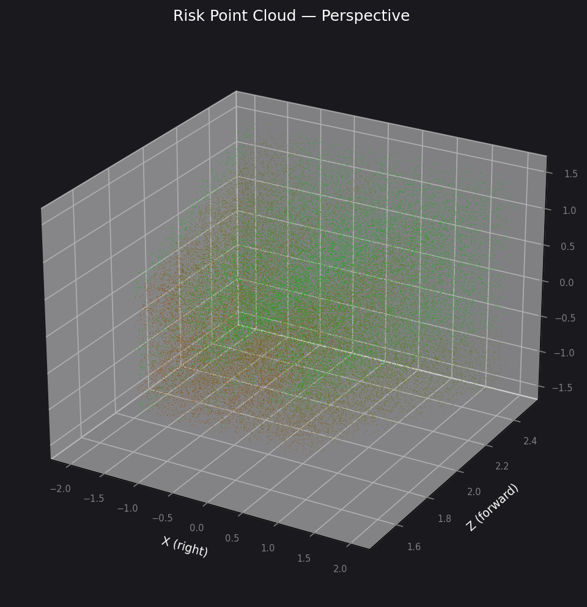
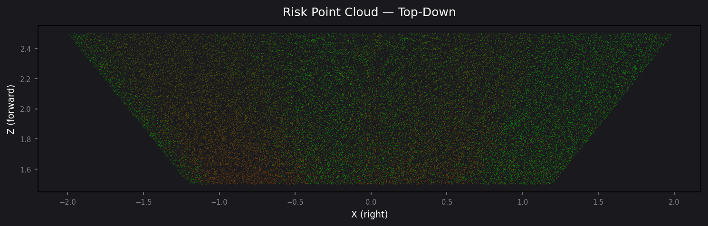

# Navigation System

The navigation module takes the per-pixel danger map and produces an
actionable steering command for an AUV, plus a 3-D risk point cloud for
post-mission review.

---

## 3-Panel Overlay

Every frame is presented as a **3-panel strip** so the full pipeline is
visible at a glance:

| Panel | What it shows |
|-------|---------------|
| **Original** | Raw underwater camera frame |
| **Danger Map** | Grayscale background + HOT heatmap (risk 0 → 1) with class contours |
| **Navigation** | Full-image 3x3 sector grid with risk values + nav command |


*Wreck scene — high risk (red/orange) on the wreck surfaces, low risk
(green) in the upper-right water column. Nav command: **ASCEND RIGHT**.*

---

## How the 3x3 Sector Grid Works

The image is divided into a **3x3 grid** of equal-sized sectors:

```
┌──────────┬──────────┬──────────┐
│  top-l   │  top-c   │  top-r   │
│  (TL)    │  (TC)    │  (TR)    │
├──────────┼──────────┼──────────┤
│  mid-l   │  center  │  mid-r   │
│  (ML)    │  (C)     │  (MR)    │
├──────────┼──────────┼──────────┤
│  bot-l   │  bot-c   │  bot-r   │
│  (BL)    │  (BC)    │  (BR)    │
└──────────┴──────────┴──────────┘
```

For each sector the **mean risk** across all pixels in that region is
computed. In the Navigation panel:

- Each sector is tinted **green** (low risk) to **red** (high risk).
- The **safest sector** (lowest mean risk) is highlighted with a white border.
- The numeric risk value `0.00` – `1.00` is printed in each cell.

### Reading the Navigation Panel

1. **Look at the colours** — green sectors are safe to steer toward,
   red sectors contain obstacles or hazards.
2. **Check the white border** — that is the safest sector the AUV would
   steer toward.
3. **Read the command banner** at the bottom — this is the plain-English
   direction the AUV should move.

---

## Navigation Commands

The AUV steers **toward** the safest sector. The mapping from safest
sector to command is:

| Safest Sector | Command | Meaning |
|---------------|---------|---------|
| top-l | `ASCEND LEFT` | Move up and left |
| top-c | `ASCEND` | Move up |
| top-r | `ASCEND RIGHT` | Move up and right |
| mid-l | `GO LEFT` | Strafe left |
| center | `PROCEED` | Continue forward |
| mid-r | `GO RIGHT` | Strafe right |
| bot-l | `DESCEND LEFT` | Move down and left |
| bot-c | `DESCEND` | Move down |
| bot-r | `DESCEND RIGHT` | Move down and right |

**Special case — STOP**: If the overall risk level is `DANGER` (mean risk
> 0.55) *and* even the safest sector has risk above 0.20, the system
commands `STOP` because no sector is safe enough to navigate into.

### Risk Levels

| Level | Overall Mean Risk | Banner Colour |
|-------|-------------------|---------------|
| `CLEAR` | < 0.20 | Green |
| `CAUTION` | 0.20 – 0.55 | Orange |
| `DANGER` | > 0.55 | Red |

---

## How the Danger Map Score is Computed

Each pixel's risk is the product of two factors:

```
risk(x, y) = hazard(x, y) × proximity(x, y)
```

**Hazard** — what class of object is here? Each SUIM-Net class has a
weight reflecting how dangerous a collision would be:

| Class | Weight | Rationale |
|-------|--------|-----------|
| HD (Human Diver) | 1.0 | Highest priority to avoid |
| WR (Wreck/Ruin) | 0.9 | Large hard structure |
| RI (Reef/Invertebrate) | 0.8 | Hard structural hazard |
| FV (Fish/Vertebrate) | 0.5 | Mobile, moderate risk |
| RO (Robot/Instrument) | 0.2 | Not a natural hazard |

**Proximity** — how close is it? Uses the SPADE depth estimate:

```
proximity(x, y) = clamp( (near_m / depth(x, y))^power, 0, 1 )
```

- `near_m = 1.0 m` — objects at 1 m or closer get full proximity (1.0).
- `power = 1.0` — linear decay (halve distance → double proximity).

Objects that are dangerous *and* close produce high risk. Distant objects
or safe classes produce low risk.

---

## 3-D Risk Point Cloud

When metric depth is available, each pixel is **unprojected** into 3-D
camera-frame coordinates using pinhole camera intrinsics:

```
X = (u - cx) × depth / fx
Y = (v - cy) × depth / fy
Z = depth
```

Each 3-D point is coloured on a **green → red** gradient based on its
risk score, producing a spatial map that shows *where in 3-D space* the
AUV faces collision risk.

### Perspective View



The perspective view shows the 3-D structure of the scene. Green points
are safe regions; red points are hazardous obstacles. The cloud is in
camera frame: +X right, +Y down, +Z forward.

### Top-Down View



The top-down (bird's-eye) view collapses the vertical axis, showing the
lateral and forward distribution of risk — useful for path planning on a
2-D map.

### Generating Point Cloud Images

```bash
# 1. Generate a PLY from the quick test
python -m src.danger_map.quick_test

# 2. Render the PLY to PNG (uses matplotlib; install open3d for better quality)
python scripts/render_ply.py reports/danger_map/quick_test/sample_cloud.ply \
    --out_dir figures/pointcloud
```

The PLY files can also be opened in **MeshLab** or **CloudCompare** for
interactive inspection.

---

## Integration with an AUV Planning Stack

The `NavResult` dataclass returned by `nav_command()` is designed to feed
directly into an AUV's reactive planner:

```python
from src.danger_map.navigate import nav_command

result = nav_command(risk_map, depth_m)

# result.command       → "ASCEND RIGHT"  (string for the planner)
# result.sector_risks  → {"top-l": 0.12, "top-c": 0.04, ...}
# result.safest        → "top-r"
# result.risk_level    → "CAUTION"
# result.overall_risk  → 0.31
```

The sector risk dict provides finer-grained input for planners that
accept continuous cost fields rather than discrete commands.
