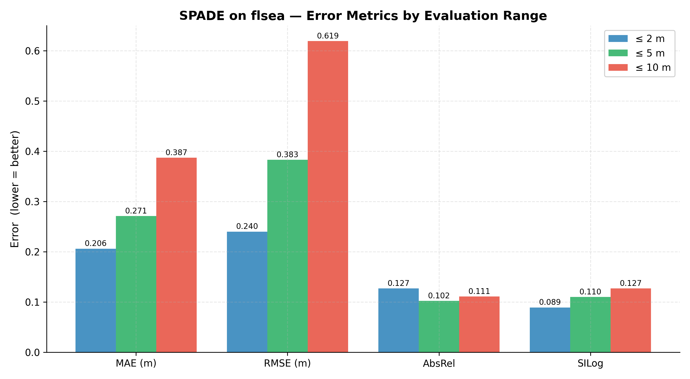
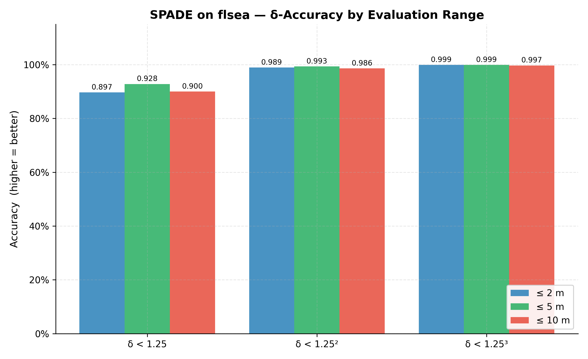
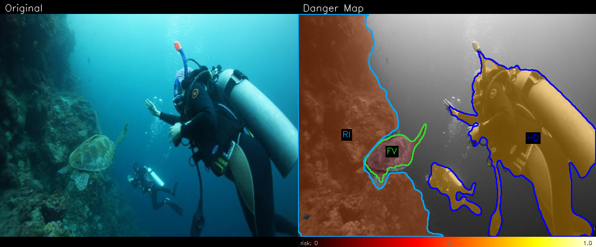
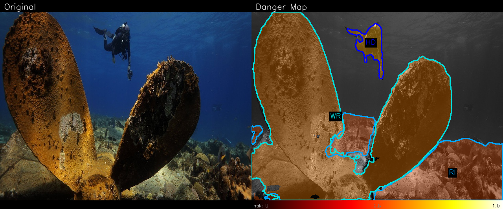
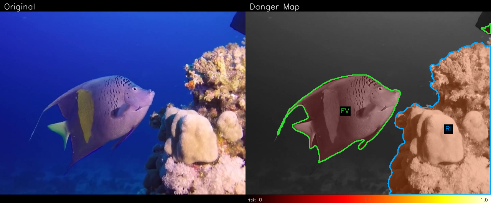

# ROB 472 Winter 2026 — Underwater Danger Map: Progress Report

**Brandon McDonald, Caitlin Roberts, Sydney Ragla**
University of Michigan · ROB 472 Winter 2026

---

## Introduction

Marine robots operating underwater face more perception challenges compared to terrestrial systems. Light scattering, color attenuation, turbidity, and low visibility make it difficult for autonomous underwater vehicles (AUVs) to reliably interpret and detect objects in their surroundings [1]. Yet accurate perception is essential for tasks such as shipwreck inspection, environmental monitoring, coral reef surveys, and infrastructure inspection. Effective autonomy in underwater environments requires robots to both interpret the semantic content of their environment and estimate spatial depth of surrounding objects [2]. For example, an AUV performing close-range imaging must avoid collisions with the seafloor, reefs, debris, or other obstacles while navigating in cluttered conditions. This requires real-time segmentation and distance estimation, enabling safer autonomy.

Models for underwater semantic segmentation and monocular depth estimation have been recently developed to address these challenges. The Semantic Segmentation of Underwater Imagery (SUIM) dataset is the first large-scale dataset for underwater image segmentation [3]. The SUIM dataset, along with the SUIM-Net segmentation model, provide eight classification categories that improve understanding of underwater scenes across a range of environments. The SUIM dataset includes object classes for fish, reefs, plants, and wrecks or ruins, all of which are highly relevant to underwater exploration and surveying [3].

At the same time, the SPADE algorithm provides monocular depth estimation for real-time underwater applications [4]. The SPADE algorithm improves on Ebner's previous work in monocular depth estimation as it achieves competitive performance at significantly faster runtimes [4][5]. The SPADE monocular depth estimation pipeline demonstrates strong robustness to different levels of depth point sparsity and exhibits great generalization on underwater data [4].

The SUIM and SPADE algorithms, when used independently, are both well-suited for underwater vehicles. Our major project goal is to explore how combining underwater semantic segmentation and monocular depth estimation may improve environment understanding for underwater vehicles. Using these two models together, we will construct a depth-aware "danger map" that highlights nearby obstacles based on both type and estimated proximity to the robot.

**System-level goal.** Given a single underwater RGB frame and a sparse set of depth hint points (e.g., from a sonar or SLAM system), produce a real-time per-pixel collision risk score in [0, 1] that an AUV can consume directly for obstacle avoidance decisions — prioritizing the objects that are both semantically hazardous and physically close.

---

## Technical Approach

Our technical approach consists of three main parts: underwater semantic segmentation, monocular depth estimation, and combining these results into a danger map that reflects collision risk.

### Benchmark 1: SUIM-Net Semantic Segmentation

**What we did.** We evaluated the SUIM-Net model (Islam et al., 2020) [3], a fully-convolutional encoder-decoder network trained on the SUIM dataset. The model classifies each pixel into five obstacle-relevant categories: Fish/Vertebrates (FV), Human Divers (HD), Reef/Invertebrates (RI), Robot/Instruments (RO), and Wrecks/Ruins (WR). We ran inference on the SUIM test split to establish an in-domain baseline, then evaluated cross-dataset generalization on DeepFish [6] and USIS10K [7]. Per-pixel metrics (IoU, Dice, Precision, Recall) were computed per class for every image.

**Datasets tested.**

| Dataset | Images | Classes evaluated | Type |
|---------|--------|-------------------|------|
| SUIM TEST | 110 | FV, HD, RI, RO, WR | In-domain baseline |
| DeepFish | 310 | FV only | Cross-dataset generalization |
| USIS10K TEST | 1,596 | FV, HD, RI, RO, WR | Cross-dataset generalization |

**Results.**

*SUIM TEST (in-domain baseline):*

| Class | IoU | Dice | Precision | Recall |
|-------|-----|------|-----------|--------|
| Fish/Vertebrate (FV) | 0.699 | 0.748 | 0.772 | 0.907 |
| Human Diver (HD) | 0.828 | 0.855 | 0.874 | 0.944 |
| Reef/Invertebrate (RI) | 0.602 | 0.632 | 0.646 | 0.948 |
| Robot/Instrument (RO) | 0.950 | 0.962 | 0.990 | 0.959 |
| Wreck/Ruin (WR) | 0.817 | 0.838 | 0.859 | 0.956 |
| **mIoU** | **0.779** | | | |

The model performs strongly on its training distribution. Robot/instrument detection is near-perfect (IoU = 0.950), and divers and wrecks are segmented reliably. Reef/invertebrate is the weakest class (IoU = 0.602), likely due to the high visual diversity of coral and invertebrate textures.

**Per-class metric breakdown (SUIM TEST):**


*DeepFish (cross-dataset, fish class only):*

| Class | IoU | Dice | Precision | Recall |
|-------|-----|------|-----------|--------|
| Fish/Vertebrate (FV) | 0.061 | 0.084 | 0.631 | 0.063 |

Generalization to DeepFish drops sharply. The model rarely activates the fish class on DeepFish imagery despite high precision when it does (0.631), indicating it is highly conservative — it nearly never predicts fish (recall = 0.063). DeepFish images show fish against very different backgrounds (open water, aquaculture pens) compared to SUIM's reef-heavy scenes, which likely explains the failure.

*USIS10K TEST (cross-dataset):*

| Class | IoU | Dice | Precision | Recall |
|-------|-----|------|-----------|--------|
| Fish/Vertebrate (FV) | 0.323 | 0.388 | 0.530 | 0.679 |
| Human Diver (HD) | 0.766 | 0.776 | 0.815 | 0.943 |
| Reef/Invertebrate (RI) | 0.184 | 0.213 | 0.240 | 0.829 |
| Robot/Instrument (RO) | 0.949 | 0.949 | 0.976 | 0.973 |
| Wreck/Ruin (WR) | 0.407 | 0.411 | 0.460 | 0.929 |
| **mIoU** | **0.526** | | | |

USIS10K shows partial generalization. Robot detection remains near-perfect (IoU = 0.949) and human divers transfer well (IoU = 0.766). Fish (0.323), Wreck (0.407), and particularly Reef (0.184) degrade significantly, with low precision indicating high false-positive rates. High recall for these classes (0.68–0.83) suggests the model is detecting something in the right regions but with poor boundary accuracy.

**Sample segmentation outputs:**

The figures below show SUIM-Net predictions on sample images. Each pixel is color-coded by class: Red = Robot, Yellow = Fish, Blue = Diver, Magenta = Reef, Cyan = Wreck.

| | |
|:---:|:---:|
|  |  |
| Diver holding a robot instrument — HD (blue) and RO (red) correctly segmented, reef (magenta) along the seafloor | Wreck scene — WR (cyan) dominates the propeller blades, HD (blue) detected in the background |
|  |  |
| Sea turtle with diver — FV (yellow) on the turtle, HD (blue) on the diver, RI (magenta) on the reef below | Angelfish near coral — FV (yellow) cleanly segments the fish, RI (magenta) on the reef |

**Cross-dataset metric comparison:**


**Summary.** SUIM-Net establishes a strong in-domain baseline (mIoU = 0.779) but generalizes unevenly. Structural classes like robots and divers transfer well across datasets, while biotic classes (fish, reef) are highly scene-dependent. This is an important limitation for the danger map, as fish and reef are among the most safety-relevant objects for AUV navigation.

---

### Benchmark 2: SPADE Monocular Depth Estimation

**What we did.** We benchmarked the SPADE model (Zhang et al., 2025) [4], a two-stage depth estimation pipeline that combines a Depth Anything V2 monocular backbone with a Deformable Attention Transformer (DAT) refinement head conditioned on sparse depth hint points. SPADE produces dense, metric-scale depth maps from a single RGB image plus a small set of sparse depth measurements (typically from a sonar or SLAM system).

The official pretrained SPADE checkpoint is hosted on a restricted Google Drive and is not publicly accessible. We therefore assembled a runnable checkpoint from the publicly available Depth Anything V2 ViT-S backbone [8], with the DAT refinement head randomly initialized. This configuration corresponds to the **DA V2 + GA** (Global Alignment) baseline row in the SPADE paper — the full SPADE refinement head is not active. Sparse depth hints were simulated from dense ground-truth depth using Shi-Tomasi corner detection, consistent with the SPADE evaluation protocol.

**Datasets tested.**

| Dataset | Images | GT depth source | Evaluation ranges |
|---------|--------|-----------------|-------------------|
| FLSea-VI validation | 4,483 | Depth image (metres) | ≤10 m, ≤5 m, ≤2 m |
| SeaThru | ~1,100 | SFM reconstruction (metres) | ≤10 m, ≤5 m, ≤2 m |

**Results (FLSea-VI, 4,483 images).**

| Eval range | MAE (m) | RMSE (m) | AbsRel | SILog | δ < 1.25 | δ < 1.25² | δ < 1.25³ |
|-----------|---------|----------|--------|-------|-----------|-----------|-----------|
| ≤ 10 m | 0.387 | 0.619 | 0.111 | 0.127 | 0.900 | 0.986 | 0.997 |
| ≤ 5 m | 0.271 | 0.383 | 0.102 | 0.110 | 0.928 | 0.993 | 0.999 |
| ≤ 2 m | 0.206 | 0.240 | 0.127 | 0.089 | 0.897 | 0.989 | 0.999 |

The model achieves δ < 1.25 accuracy of 0.900 at the full ≤10 m range, meaning 90% of predicted depths are within 25% of ground truth. Performance improves substantially in the near-field (≤5 m and ≤2 m ranges), which is the operationally critical zone for AUV collision avoidance. At ≤5 m, absolute error drops to 0.271 m — well within the precision needed to distinguish safe from unsafe approach distances. The SPADE paper's DA V2 + GA baseline (the same configuration we use) reports FLSea MAE ≈ 0.277 m and AbsRel ≈ 0.081 at ≤10 m [4]; our results are comparable given the simulated sparse hints and reproduced checkpoint.

SeaThru results are pending (evaluation job currently running on ARC Great Lakes).

**Error and accuracy charts (FLSea-VI):**





**Sample depth predictions (FLSea-VI):**

Each panel shows the RGB input with sparse depth hint points overlaid (left) and the predicted dense depth map with a depth colorbar (right).

| | |
|:---:|:---:|
|  |  |
| Seafloor with structured terrain — depth gradients captured from near (~3 m) to far (~12 m) | Sandy slope — near-field seafloor and far-field water column distinguished |
|  | |
| Rocky reef — smooth depth transition across foreground rocks to background water |

**Metrics reported.** Mean Absolute Error (MAE), Root Mean Squared Error (RMSE), Absolute Relative Error (AbsRel), Scale-Invariant Log Error (SILog), and δ-accuracy thresholds (δ < 1.25, 1.25², 1.25³), all computed over valid depth pixels within each evaluation range.

---

### Goal 3: Underwater Danger Map

**What we did.** We implemented a fused danger map that combines SUIM-Net segmentation outputs and SPADE depth estimates into a single per-pixel collision risk score. The algorithm is fully implemented in `src/danger_map/` and has been tested on the SUIM sample imagery using synthetic flat-depth maps.

**Risk formula.**

```
proximity(x,y)  =  clip( (near_m / depth(x,y))^power,  0, 1 )

hazard(x,y)     =  max hazard_weight over all SUIM-Net classes active at (x,y)
                   "active" = sigmoid output > seg_threshold (default 0.5)

risk(x,y)       =  hazard(x,y) × proximity(x,y)   ∈ [0, 1]
```

Proximity saturates to 1.0 for objects closer than `near_m` (default 1 m) and falls off as `1/depth` beyond that. Hazard weights encode class severity — divers (HD) are weighted 1.0 (highest), reefs and wrecks 0.8–0.9, fish 0.5, and robots 0.2. Only the maximum-weight active class at each pixel contributes, preventing double-counting when multiple classes overlap (e.g., a diver holding a robot). Pixels with invalid depth (zero or NaN) receive risk = 0 to avoid false alarms from missing sensor data.

**Per-class hazard weights.**

| Class | Weight | Rationale |
|-------|--------|-----------|
| Human Diver (HD) | 1.0 | Highest priority — diver injury is unacceptable |
| Wreck / Ruin (WR) | 0.9 | Large rigid structure, high collision damage |
| Reef / Invertebrate (RI) | 0.8 | Hard structural hazard, ecologically sensitive |
| Fish / Vertebrate (FV) | 0.5 | Mobile, moderate impact risk |
| Robot / Instrument (RO) | 0.2 | Not a natural obstacle for the AUV |

**Overlay design.** The output overlay uses a grayscale background (to eliminate color-on-color clash with blue/green underwater imagery), a HOT colormap (black → red → yellow → white) blended with per-pixel alpha equal to `risk × overlay_alpha`, and per-class contour labels drawn at each segmented region's centroid. This allows an operator or downstream planner to read both the risk intensity and the causal class at a glance.

**Sample danger map outputs (synthetic 2 m flat depth, real SUIM-Net inference):**

The figures below use a uniform 2 m depth map so that all detected objects contribute a fixed proximity score of `clip(1/2, 0, 1) = 0.5`, isolating the effect of class hazard weights on the final risk. Full-pipeline outputs with real SPADE depth are in progress.

| | |
|:---:|:---:|
|  |  |
| Diver (HD, blue) and reef (RI, orange) detected — diver region shows highest risk (brown/red) due to HD weight = 1.0 | Wreck propeller blades (WR, cyan) and diver in background (HD, blue) — both correctly labelled with appropriate risk levels |
|  | |
| Angelfish (FV, green) and coral reef (RI, orange) — fish shows lower risk than reef due to FV weight = 0.5 vs RI weight = 0.8 |

**Robustness and domain gap.** A key limitation identified by our cross-dataset evaluation is that SUIM-Net's segmentation quality degrades significantly on out-of-domain imagery (mIoU drops from 0.779 to 0.526 on USIS10K). To quantify how environmental degradation affects the danger map, we are running a turbidity sweep that applies increasing levels of simulated backscatter and color attenuation to SUIM test images and measures per-class IoU degradation. Results will inform which classes — and therefore which hazard detections — are most sensitive to water clarity.

---

## Remaining Milestones

| Sub-goal | Status | Target date |
|----------|--------|-------------|
| SPADE FLSea benchmark | **Complete** — 4,483 images, results above | Mar 2026 |
| SPADE SeaThru benchmark | In progress — ARC job running | Mar 30, 2026 |
| Danger map algorithm | **Complete** — implemented and tested | Mar 2026 |
| Danger map video on FLSea sequences | In progress — pipeline ready, ARC run pending | Apr 5, 2026 |
| Turbidity robustness sweep | In progress — ARC job ready to submit | Apr 5, 2026 |
| Latency profiling | Planned — time both models per frame on GPU node | Apr 5, 2026 |
| Final report | In progress | Apr 12, 2026 |

---

## References

[1] D. Q. Huy et al., "Object perception in underwater environments: a survey on sensors and sensing methodologies," *Ocean Engineering*, vol. 267, p. 113202, Jan. 2023. https://doi.org/10.1016/j.oceaneng.2022.113202

[2] B. Yu, J. Wu, and M. J. Islam, "UDepth: Fast Monocular Depth Estimation for Visually-guided Underwater Robots," arXiv:2209.12358, 2022. https://arxiv.org/abs/2209.12358

[3] M. J. Islam et al., "Semantic Segmentation of Underwater Imagery: Dataset and Benchmark," arXiv:2004.01241, 2020. https://arxiv.org/abs/2004.01241

[4] H. Zhang, G. Billings, and S. B. Williams, "SPADE: Sparsity Adaptive Depth Estimator for Zero-Shot, Real-Time, Monocular Depth Estimation in Underwater Environments," arXiv:2510.25463, 2025. https://arxiv.org/abs/2510.25463

[5] L. Ebner, G. Billings, and S. Williams, "Metrically Scaled Monocular Depth Estimation through Sparse Priors for Underwater Robots," arXiv:2310.16750, 2023. https://arxiv.org/abs/2310.16750

[6] S. Saleh et al., "DeepFish: A Realistic Fish-Habitat Dataset to Evaluate Algorithms for Underwater Visual Analysis," *Scientific Reports*, 2020. https://alzayats.github.io/DeepFish/

[7] S. Lian et al., "Diving into Underwater: Segment Anything Model Guided Underwater Salient Instance Segmentation and A Large-scale Dataset," arXiv:2406.06039, 2024. https://arxiv.org/abs/2406.06039

[8] L. Yang et al., "Depth Anything V2," arXiv:2406.09414, 2024. https://arxiv.org/abs/2406.09414
