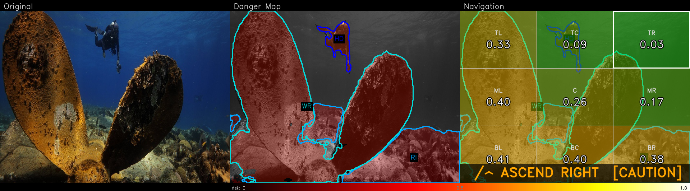
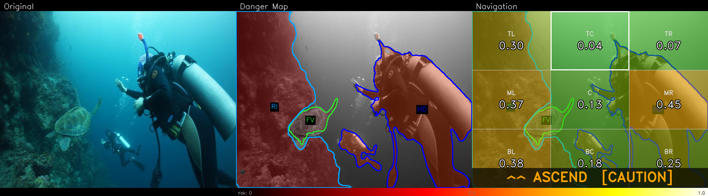
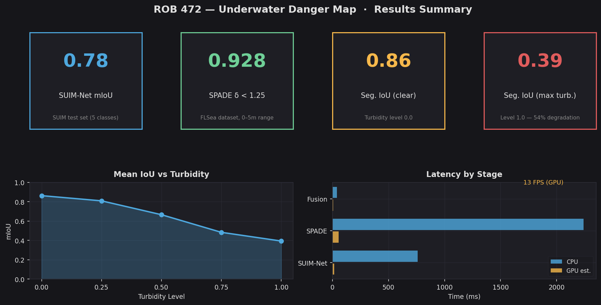
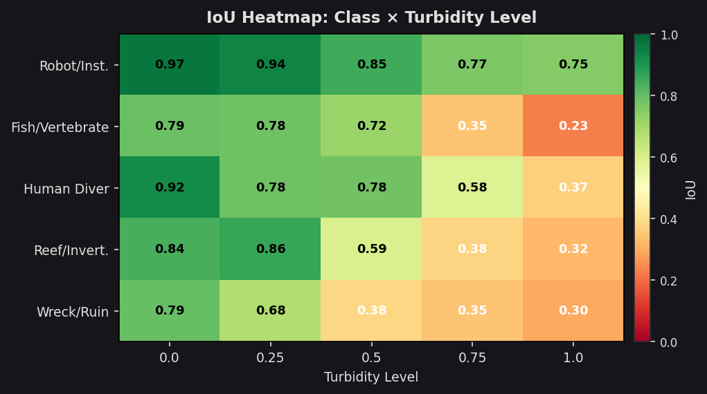
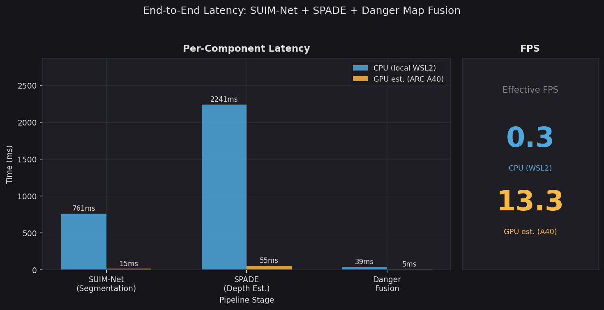
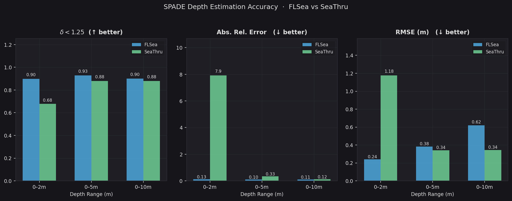

# ROB 472 — Underwater Danger Map

**Brandon McDonald · Caitlin Roberts · Sydney Ragla**
University of Michigan · ROB 472 Winter 2026

End-to-end pipeline that segments underwater hazards with SUIM-Net, estimates metric depth with SPADE, and fuses them into a per-pixel **danger map** with an actionable AUV navigation command.

```
RGB frame → SUIM-Net → class logits ─┐
                                      ├→ danger_map() → risk_map → nav_command()
           → SPADE   → depth (m)  ───┘                             ↓
                                                         [ ASCEND LEFT | PROCEED | STOP … ]
```

---

## Results

| Metric | Value |
|--------|-------|
| SUIM-Net mIoU (SUIM test set) | **0.78** |
| SUIM-Net mIoU at turbidity 0.5 | **0.67** |
| SUIM-Net mIoU at turbidity 1.0 | **0.39** (−54%) |
| SPADE δ<1.25 (FLSea, 0–5m) | **0.928** |
| SPADE δ<1.25 (SeaThru, 0–5m) | **0.879** |
| Pipeline FPS — GPU est. (ARC A40) | **~13 FPS** |

### Danger map overlay (3-panel)

| Wreck scene | Diver scene |
|:-----------:|:-----------:|
|  |  |
| `ASCEND RIGHT [CAUTION]` — wreck surfaces red, open water green | `ASCEND [CAUTION]` — diver (HD) and reef (RI) highlighted |

### Charts

| | |
|:-:|:-:|
|  |  |
| Results summary card | IoU heatmap: class × turbidity level |
|  |  |
| Latency breakdown: CPU vs GPU | SPADE depth accuracy: FLSea vs SeaThru |

Regenerate all charts from CSVs:
```bash
python scripts/make_report_figures.py
```

---

## Repository structure

```
src/
  danger_map/         # Core pipeline — risk scoring, overlay, video, navigation
    __init__.py       # danger_map() — risk = hazard_weight × proximity
    navigate.py       # nav_command(), draw_nav_overlay(), PLY writer
    run_video.py      # Full video pipeline (--video_file or --frames_dir)
    quick_test.py     # CPU smoke test on 8 bundled images
    profile_latency.py
  suimnet/            # Segmentation inference, metrics, charts
  spade/              # Depth estimation, evaluation, charts
  augment/            # Turbidity augmentation + robustness sweep
scripts/
  make_report_figures.py   # Regenerate all charts from CSVs
  compare_pointcloud.py    # Danger map + 3D point cloud comparison figure
  render_ply.py            # Render .ply to perspective + top-down PNGs
cluster/
  video_danger_map.sbat    # SLURM: run danger map on raw MP4 videos
  danger_map.sbat          # SLURM: run danger map on frame-folder datasets
  turbidity_sweep.sbat     # SLURM: turbidity robustness sweep
  suimnet_*.sbat / spade_*.sbat
videos/
  raw/               # Input videos (bluerov1.mp4, bluerov2.mp4, …)
  processed/         # Output — danger_map.mp4 per video (generated on ARC)
figures/
  charts/            # Report-ready charts (turbidity, latency, SPADE, SUIM-Net)
  danger_map/        # Danger map overlay samples
  pointcloud/        # Risk point cloud renders
reports/
  suimnet/           # Per-image segmentation metrics CSVs
  spade/             # Depth accuracy CSVs + visualisations
  turbidity/         # Turbidity sweep CSVs per level
  latency_local.csv  # CPU latency baseline
vendor/
  SUIM-Net/          # Upstream segmentation model (git submodule)
  SPADE/             # Upstream depth estimator (git submodule)
```

---

## Local quick-start

The danger map smoke test runs on CPU with 8 bundled images — no datasets or GPU required:

```bash
git clone <repo_url> && cd rob472-underwater-danger-map
git submodule update --init --recursive
python3 -m venv .venv && source .venv/bin/activate
pip install -r requirements.txt
python -m src.danger_map.quick_test
# → reports/danger_map/quick_test/
```

---

## Video pipeline on ARC

Running the full pipeline on the raw videos requires a GPU.
See **[ARC_VIDEO_PIPELINE.md](ARC_VIDEO_PIPELINE.md)** for step-by-step instructions.

```bash
# Quick reference — submit all 3 videos on ARC:
sbatch --export=VIDEO=videos/raw/bluerov1.mp4 cluster/video_danger_map.sbat
sbatch --export=VIDEO=videos/raw/bluerov2.mp4 cluster/video_danger_map.sbat
sbatch --export=VIDEO=videos/raw/multimedia-unexpected-1920x1080-1.mp4 cluster/video_danger_map.sbat
```

---

## Setup (two venvs — TF and PyTorch conflict)

| Model | Requirements | Framework |
|-------|-------------|-----------|
| SUIM-Net | `requirements.txt` | TensorFlow 2.13 |
| SPADE + full pipeline | `requirements_spade.txt` | PyTorch ≥ 2.1 + TF |

```bash
# Full pipeline venv (includes both TF and PyTorch):
python3 -m venv .venv && source .venv/bin/activate
pip install -r requirements_spade.txt
pip install "typing_extensions>=4.10.0"   # re-pin after TF downgrades it
```

---

## Navigation system

See **[NAVIGATION.md](NAVIGATION.md)** for a full explanation of the 3-panel overlay, sector risk grid, nav commands, and 3D risk point cloud.

---

## References

1. Islam et al., "Semantic Segmentation of Underwater Imagery: Dataset and Benchmark," 2020. [arXiv:2004.01241](https://arxiv.org/abs/2004.01241)
2. Zhang et al., "SPADE: Sparsity Adaptive Depth Estimator," 2025. [arXiv:2510.25463](https://arxiv.org/abs/2510.25463)
3. Ebner et al., "Metrically Scaled Monocular Depth Estimation through Sparse Priors for Underwater Robots," 2023. [arXiv:2310.16750](https://arxiv.org/abs/2310.16750)
4. FLSea-VI — Randall & Treibitz, 2023. [HuggingFace](https://huggingface.co/datasets/bhowmikabhimanyu/flsea-vi)
5. SeaThru — Akkaynak & Treibitz, CVPR 2019. [Kaggle](https://www.kaggle.com/datasets/colorlabeilat/seathru-dataset)
