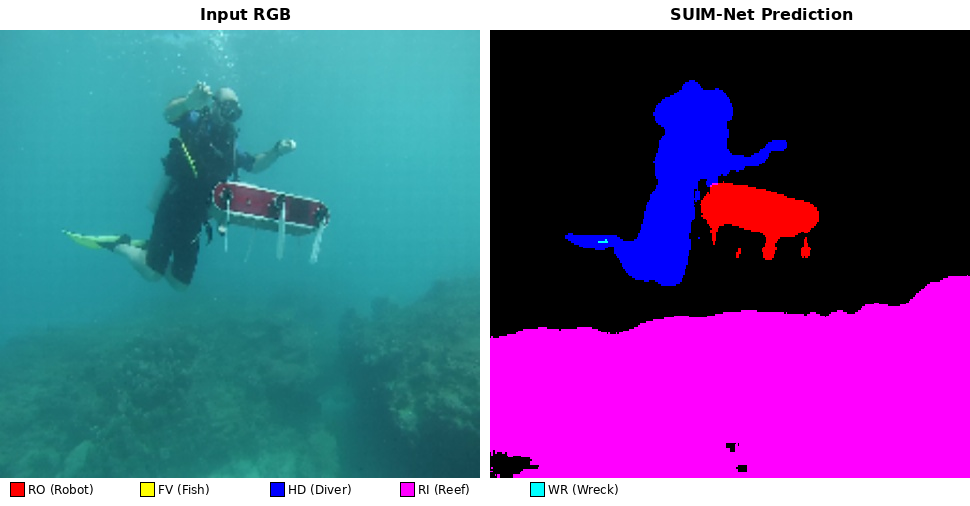
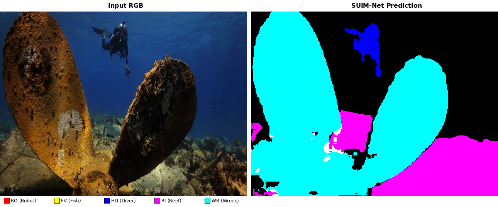
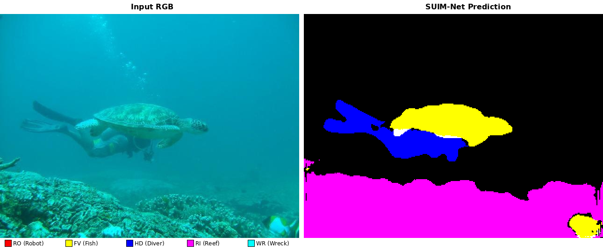
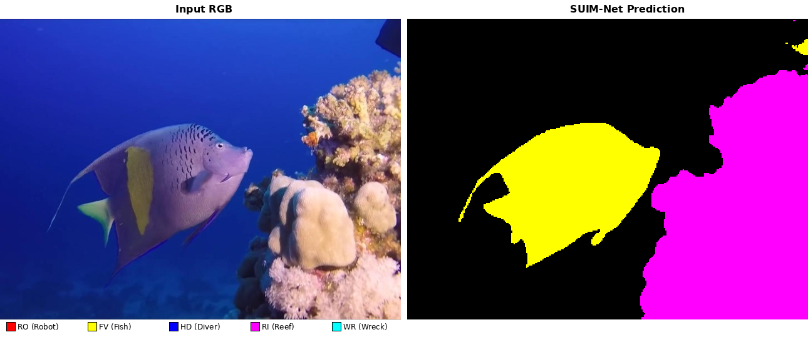

# SUIM-Net — Underwater Semantic Segmentation (Goal 1)

> **Project context:** This is Goal 1 of the ROB 472 Underwater Danger Map project.
> We establish a segmentation baseline on SUIM, then evaluate cross-dataset generalization
> on DeepFish and USIS10K. The segmentation masks produced here feed into the
> [danger map fusion](../danger_map/README.md) module (Goal 3) alongside SPADE depth maps.

Semantic segmentation of underwater imagery using the SUIM-Net model (Islam et al., 2020).
Segments scenes into five obstacle-relevant classes and computes pixel-level metrics against
ground-truth masks.

---

## Datasets

| Key | Dataset | Labels | Classes evaluated |
|-----|---------|--------|-------------------|
| `suim` | [SUIM TEST split](https://drive.google.com/file/d/1uEnlqKrlt6lITc_i80NTtb7iHGcO47sU) | Per-class binary BMP | RO FV HD RI WR (all 5) |
| `deepfish` | [DeepFish](http://data.qld.edu.au/public/Q5842/.../DeepFish.tar) | Binary fish masks | FV only |
| `usis10k` | [USIS10K TEST split](https://drive.google.com/file/d/1LdjLPaieWA4m8vLV6hEeMvt5wHnLg9gV) | COCO JSON (7 classes) | RO FV HD RI WR (after conversion) |

Charts are output to `reports/suimnet/figures/<dataset>/` — one directory per dataset.

---

## Project structure

```
src/suimnet/
  run_infer.py        # inference wrapper (includes Keras compat shim)
  metric_calc.py      # per-class IoU / Dice / Precision / Recall
  chart_metrics.py    # report-quality visualisation charts
cluster/
  suimnet_infer.sbat  # SLURM: GPU inference
  suimnet_metrics.sbat# SLURM: CPU metrics
configs/
  profiles.yaml       # data_root / outputs_root per environment
  datasets.yaml       # dataset-specific relative paths
vendor/SUIM-Net/      # upstream model code (DO NOT MODIFY)
outputs/<dataset>/    # generated prediction masks
reports/suimnet/      # metrics CSVs and figures
```

---

## Quick-start (local)

### 1. Set up environment

```bash
python3 -m venv .venv && source .venv/bin/activate
pip install --upgrade pip
pip install -r requirements.txt
```

### 2. Smoke-test with bundled sample data

The repo ships 8 images + ground truth in `vendor/SUIM-Net/sample_test/`. No download needed:

```bash
# Inference
python -m src.suimnet.run_infer \
    --images_dir vendor/SUIM-Net/sample_test/images \
    --dataset sample

# Metrics
python -m src.suimnet.metric_calc \
    --preds_dir outputs/sample \
    --masks_dir vendor/SUIM-Net/sample_test/masks \
    --out_csv reports/suimnet/sample_metrics.csv

# Charts (report quality, 300 DPI)
python -m src.suimnet.chart_metrics \
    --csv reports/suimnet/sample_metrics.csv \
    --title "SUIM-Net Sample (8 images)"
```

Charts saved to `reports/suimnet/figures/`.

### 3. Run on any dataset

**Step 1 — Register the dataset** in `configs/datasets.yaml`:

```yaml
datasets:
  my_dataset:
    images_rel: my_dataset/images   # relative to data_root in profiles.yaml
    labels_rel: my_dataset/masks    # omit or set null if no ground truth
    has_labels: true
```

**Step 2 — Point `configs/profiles.yaml`** at your data root:

```yaml
profiles:
  local:
    data_root: /path/to/your/data
    outputs_root: outputs
```

**Step 3 — Run**:

```bash
python -m src.suimnet.run_infer --profile local --dataset my_dataset
python -m src.suimnet.metric_calc \
    --profile local --dataset my_dataset \
    --preds_dir outputs/my_dataset \
    --out_csv reports/suimnet/my_dataset_metrics.csv
python -m src.suimnet.chart_metrics \
    --csv reports/suimnet/my_dataset_metrics.csv \
    --title "My Dataset (N images)"
```

Or point directly at any image folder without touching the config:

```bash
python -m src.suimnet.run_infer --images_dir /any/path/to/images --dataset my_run
```

---

## Running on ARC Great Lakes

> **Tested:** 110 SUIM test images in ~20 seconds on a Tesla V100-PCIE-16GB.

### Prerequisites

**1. GitHub SSH key on Great Lakes**

```bash
ssh-keygen -t ed25519    # on Great Lakes login node
# Copy ~/.ssh/id_ed25519.pub → https://github.com/settings/keys
ssh -T git@github.com    # should print "Hi <user>! You've been authenticated"
```

**2. Stage your data in scratch**

```
/scratch/rob572w26_class_root/rob572w26_class/$USER/data/
  suim/
    TEST/
      images/           ← input RGB images
      masks/
        RO/             ← binary GT masks per class (for evaluation)
        FV/
        HD/
        RI/
        WR/
  deepfish/
    images/
  lars/
    images/
```

Path layout must match `configs/datasets.yaml` (the `images_rel` / `labels_rel` fields).
Weights are pre-bundled at `vendor/SUIM-Net/sample_test/ckpt_seg_5obj.hdf5` — no download needed.

### Step-by-step

**0. Connect and pull**

```bash
ssh <uniqname>@greatlakes.arc-ts.umich.edu
cd ~/rob472-underwater-danger-map
git pull && git submodule update --init --recursive
```

**1. Download datasets**

```bash
bash scripts/download_suimnet_data.sh
```

DeepFish is ~7 GB and may take a while. Already-downloaded datasets are skipped on re-run.

**2. Convert labels to SUIM format** (SUIM is already correct — only DeepFish and USIS10K need this)

```bash
sbatch --export=DATASET=deepfish cluster/suimnet_convert.sbat
sbatch --export=DATASET=usis10k  cluster/suimnet_convert.sbat
```

Wait for both to finish before the next step.

**3. Run inference (GPU) — one job per dataset**

```bash
sbatch --export=DATASET=suim     cluster/suimnet_infer.sbat
sbatch --export=DATASET=deepfish cluster/suimnet_infer.sbat
sbatch --export=DATASET=usis10k  cluster/suimnet_infer.sbat
```

The script auto-creates `/scratch/.../venvs/rob472` and installs `requirements.txt`.

**4. Run metrics + charts (CPU) — one job per dataset**

```bash
sbatch --export=DATASET=suim     cluster/suimnet_metrics.sbat
sbatch --export=DATASET=deepfish cluster/suimnet_metrics.sbat
sbatch --export=DATASET=usis10k  cluster/suimnet_metrics.sbat
```

Each job saves `reports/suimnet/<dataset>_metrics.csv` **and** generates 300 DPI charts to
`reports/suimnet/figures/<dataset>/` automatically.

**5. Monitor jobs**

```bash
squeue -u $USER
sacct -j <JOBID> --format=JobID,State,Elapsed,ExitCode,MaxRSS
cat logs/suimnet-infer-<JOBID>.log
```

**5. Copy results locally**

```bash
# From your local machine (WSL / Mac / Linux)
scp -r "brandmcd@greatlakes.arc-ts.umich.edu:~/rob472-underwater-danger-map/reports/suimnet/" ./
```

---

## Outputs

### Prediction masks

Inference writes **RGB-encoded PNG masks** to `outputs/<dataset>/`, one per input image.

**Sample outputs (bundled 8-image test set):**

| | |
|:---:|:---:|
|  |  |
| Diver holding robot — HD (blue), RO (red), RI (magenta) | Wreck propeller — WR (cyan), HD (blue), RI (magenta) |
|  |  |
| Sea turtle with diver — FV (yellow), HD (blue), RI (magenta) | Angelfish near coral — FV (yellow), RI (magenta) |

Each pixel is colored by segmentation class:

| Class code | Description | RGB color |
|------------|-------------|-----------|
| RO | Robot / Instrument | Red `(255, 0, 0)` |
| FV | Fish / Vertebrate | Yellow `(255, 255, 0)` |
| HD | Human Diver | Blue `(0, 0, 255)` |
| RI | Reef / Invertebrate | Magenta `(255, 0, 255)` |
| WR | Wreck / Ruin | Cyan `(0, 255, 255)` |

### Metrics CSV

`reports/suimnet/<dataset>_metrics.csv` — one row per (class, image):

```
class, image, iou, dice, precision, recall
RO, d_r_122_, 0.923, 0.960, 0.941, 0.980
...
```

### Report charts (300 DPI)

Five PNGs in `reports/suimnet/figures/`:

| File | Description |
|------|-------------|
| `class_means.png` | Grouped bars: mIoU, Dice, Precision, Recall per class |
| `iou_boxplots.png` | IoU distribution per class with acceptable/good/excellent thresholds |
| `overall_summary.png` | Macro-averaged metrics (single horizontal bar per metric) |
| `iou_heatmap.png` | Classes × images heatmap, sorted by mean IoU |
| `precision_recall.png` | Precision vs Recall scatter per image, class mean marked with ★ |

---

## Metrics reference

We compute four pixel-level metrics per class:

| Metric | Formula | What it measures |
|--------|---------|------------------|
| **IoU** | `TP / (TP + FP + FN)` | Overlap between prediction and ground truth. Penalises both missed pixels and false alarms equally. Also called Jaccard Index. |
| **Dice (F1)** | `2·TP / (2·TP + FP + FN)` | Harmonic mean of Precision and Recall. Gives a higher score than IoU for the same prediction. |
| **Precision** | `TP / (TP + FP)` | Of all predicted pixels for this class, what fraction was correct? Low = many false positives. |
| **Recall** | `TP / (TP + FN)` | Of all ground-truth pixels for this class, what fraction was found? Low = many missed detections. |

> **Rule of thumb:** IoU > 0.50 acceptable · > 0.70 good · > 0.85 excellent

---

## Technical notes

### Keras compatibility shim

The vendor SUIM-Net uses Keras APIs that changed in 2.13+. `run_infer.py` includes a
monkey-patch shim (no vendor files modified) that:
1. Re-exports `keras.layers.Input` as `keras.models.Input`
2. Wraps `keras.models.Model` to accept old-style `input=`/`output=` kwargs

### Preprocessing

SUIM-Net expects images normalized to [0, 1] and resized to 240 × 320.
This is handled automatically by `skimage.transform.resize(..., preserve_range=False)`.

### RGB encoding

The 5-channel sigmoid output is thresholded at 0.5 and combined via bitwise OR:

| Channel | Class | R | G | B |
|---------|-------|---|---|---|
| 0 | RO | ✓ | — | — |
| 1 | FV | ✓ | ✓ | — |
| 2 | HD | — | — | ✓ |
| 3 | RI | ✓ | — | ✓ |
| 4 | WR | — | ✓ | ✓ |

Multi-class pixels produce combined colors due to the OR composition.
