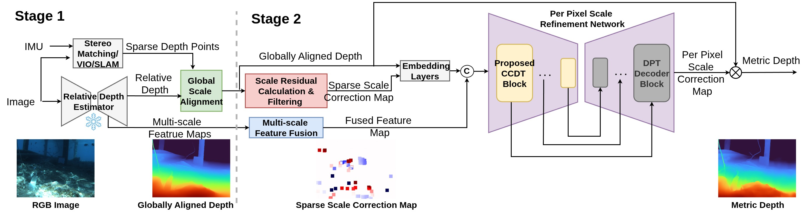

# ♠️ SPADE: Sparsity Adaptive Zero-shot Underwater Depth Estimation


## Introduction



We present SPADE (SParsity Adaptive Depth Estimator) a real-time underwater depth estimation pipeline that combines monocular relative depth estimation with sparse depth measurements to produce dense, metric scale depth maps. Our two-stage approach first scales the relative depth map, then refines the pixel-wise metric depth using a Cascade Conv-Deformable Transformer block. Our proposed method achieves improved accuracy and generalisation over state-of-the-art baselines, at the sametime, it also achieves more than 15FPS on Jetson Orin. 

## Arxiv Pre-print

If you’re interested in the details, check out our arXiv paper:

👉 [Link to our arXiv paper](https://arxiv.org/abs/2510.25463)


## Demo
<p align="center">
  
</p>

[▶️ Watch the demo](https://drive.google.com/file/d/1Tk7aJNtP39aG442j_JnzLMPlIAkZPfGn/view?usp=drive_link)


## Setup

1) Setup dependencies:

    ```shell
    conda env create -f environment.yml
    conda activate spade
    ```

2) Download pretrained weight:
       - [Download pretrained model](https://drive.google.com/file/d/1V9AxrXqA7Z7z60t5PHlwGiL5IWAiNo-3/view?usp=drive_link)  
       - Update path to the weight file into the /bash/evaluate_flsea.sh after 'local::'

## Evaluation
```shell
bash bash_scripts/evaluate_flsea.sh
```
This will run evaluation on the example data provided in this repo  
**Options (to be set *inside* `bash_scripts/evaluate_flsea.sh`):**

- `--visualize` – Show qualitative results during evaluation.
- `--save-image` – Save output images to disk.
- `--output-image-path <DIR>` – Directory where images are saved.

Below is the evaluation table of the [FLSea dataset](https://arxiv.org/abs/2302.12772). We selected over 3,000 images including images from a close-range canyon and an open-water area with artificial structures.
<table>
  <thead>
    <tr>
      <th rowspan="2">Method</th>
      <th rowspan="2">Depth Backbone</th>
      <th colspan="4">≤10 m</th>
      <th colspan="4">≤5 m</th>
      <th colspan="4">≤2 m</th>
    </tr>
    <tr>
      <th>MAE</th><th>RMSE</th><th>AbsRel</th><th>SILog</th>
      <th>MAE</th><th>RMSE</th><th>AbsRel</th><th>SILog</th>
      <th>MAE</th><th>RMSE</th><th>AbsRel</th><th>SILog</th>
    </tr>
  </thead>
  <tbody>
    <tr>
      <td>UW-Depth</td><td>No</td>
      <td>0.174</td><td>0.393</td><td>0.058</td><td>0.097</td>
      <td>0.126</td><td>0.236</td><td>0.054</td><td>0.081</td>
      <td>0.077</td><td>0.128</td><td>0.052</td><td>0.067</td>
    </tr>
    <tr>
      <td>CompletionFormer</td><td>No</td>
      <td>0.227</td><td>0.581</td><td>0.133</td><td>0.213</td>
      <td>0.177</td><td>0.471</td><td>0.138</td><td>0.209</td>
      <td>0.335</td><td>0.731</td><td>0.686</td><td>0.332</td>
    </tr>
    <tr>
      <td>DepthPrompting</td><td>Yes</td>
      <td>0.322</td><td>0.618</td><td>0.176</td><td>0.247</td>
      <td>0.272</td><td>0.496</td><td>0.178</td><td>0.247</td>
      <td>0.352</td><td>0.630</td><td>0.614</td><td>0.352</td>
    </tr>
    <tr>
      <td>DA V2 + GA</td><td>Yes</td>
      <td>0.277</td><td>0.563</td><td>0.081</td><td>0.117</td>
      <td>0.170</td><td>0.296</td><td>0.068</td><td>0.095</td>
      <td>0.099</td><td>0.151</td><td>0.065</td><td>0.076</td>
    </tr>
    <tr>
      <td>VI-Depth (Original)</td><td>Yes</td>
      <td>0.199</td><td>0.561</td><td>0.057</td><td>0.097</td>
      <td>0.126</td><td>0.319</td><td>0.048</td><td>0.076</td>
      <td>0.063</td><td>0.136</td><td>0.041</td><td><strong>0.054</strong></td>
    </tr>
    <tr>
      <td>VI-Depth*</td><td>Yes</td>
      <td>0.180</td><td>0.398</td><td>0.053</td><td>0.090</td>
      <td>0.117</td><td>0.237</td><td>0.046</td><td>0.074</td>
      <td>0.067</td><td>0.119</td><td>0.044</td><td>0.059</td>
    </tr>
    <tr>
      <td>Marigold-DC</td><td>Yes</td>
      <td>0.139</td><td>0.378</td><td>0.044</td><td>0.095</td>
      <td><strong>0.096</strong></td><td>0.247</td><td>0.040</td><td>0.080</td>
      <td>0.062</td><td>0.145</td><td>0.042</td><td>0.068</td>
    </tr>
    <tr>
      <td>Proposed (PVT)</strong></td><td>Yes</td>
      <td>0.141</td><td>0.354</td><td>0.045</td><td>0.080</td>
      <td>0.101</td><td>0.247</td><td>0.041</td><td>0.071</td>
      <td>0.056</td><td>0.121</td><td>0.038</td><td>0.055</td>
    </tr>
    <tr>
      <td>Proposed (Swin)</td><td>Yes</td>
      <td>0.166</td><td>0.385</td><td>0.052</td><td>0.084</td>
      <td>0.118</td><td>0.263</td><td>0.047</td><td>0.074</td>
      <td>0.065</td><td>0.125</td><td>0.043</td><td>0.057</td>
    </tr>
    <tr>
      <td><strong>Proposed (DAT)</strong></td><td>Yes</td>
      <td><strong>0.131</strong></td><td><strong>0.316</strong></td><td><strong>0.042</strong></td><td><strong>0.077</strong></td>
      <td><strong>0.096</strong></td><td><strong>0.219</strong></td><td><strong>0.039</strong></td><td><strong>0.068</strong></td>
      <td><strong>0.055</strong></td><td><strong>0.115</strong></td><td><strong>0.037</strong></td><td><strong>0.054</strong></td>
    </tr>
  </tbody>
</table>
<p><small><strong>Note:</strong> <strong>Bold</strong> marks the best metric; <em>*</em> indicates our re-trained VI-Depth.</small></p>


## Citation

If you use this work, please cite:

```bibtex
@misc{zhang2025spadesparsityadaptivedepth,
      title={SPADE: Sparsity Adaptive Depth Estimator for Zero-Shot, Real-Time, Monocular Depth Estimation in Underwater Environments}, 
      author={Hongjie Zhang and Gideon Billings and Stefan B. Williams},
      year={2025},
      eprint={2510.25463},
      archivePrefix={arXiv},
      primaryClass={cs.CV},
      url={https://arxiv.org/abs/2510.25463}, 
}
```

## Acknowledgements
[DepthAnythingV2](https://github.com/DepthAnything/Depth-Anything-V2)  
[DAT](https://github.com/LeapLabTHU/DAT)  
[ZoeDepth](https://github.com/isl-org/ZoeDepth)  
[VI-Depth](https://github.com/isl-org/VI-Depth)  
[FLSea](https://arxiv.org/abs/2302.12772)

